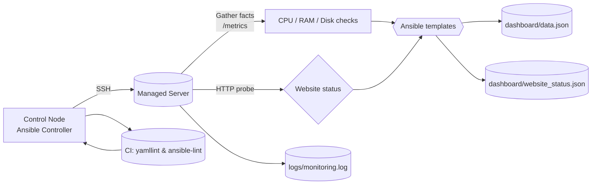

# Monitoring Data Flow

**Legend**

- `metrics` — shell-based samplers using standard Linux tools.
- `templates` — JSON render via Jinja2.
- `logs` — chronological health feed for post-mortems.
- `ci` — automated linting (GitHub Actions).

